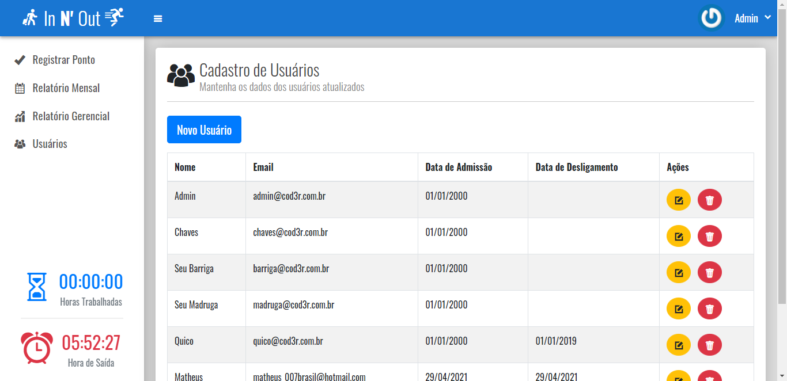

# PHP- Controle de Ponto
Aplicação para registro de controle de ponto de trabalho

 

# Sobre o projeto

É uma aplicação de controle de ponto no qual usuários devem registrar batidas de ponto 4 vezes ao dia e assim irá deixar registrado no banco, capturando as horas trabalhadass, os saldos positvos e negativos, relatórios com a quantidade de horas que os funcionários trabalharam no mês, banco de horas, CRUD completo de usuários.

## Layout da Aplicação
     

# Tecnologias utilizadas
## Back end
- PHP
## Front end
- HTML / CSS / Javascript

# Como executar o projeto

Pré-requisitos: 
* Fazer o git clone ou download do projeto, possuir um servidor web como apache,fiz com o xampp mas da para usar o wampp ou qualquer software da mesma finalidade, e possuir um Navegador web.
* Possuir o banco de dados mysql

# executar o projeto
* Colocar o diretório do projeto: "./innout/public" na raiz do seu servidor web e chama-lo através do localhost
* fazer download do arquivo sql e xecuta no seu servidor de banco de dados

# Autor

Matheus Pimentel Santos de Jesus

https://www.linkedin.com/in/matheus-pimentel-961253213

